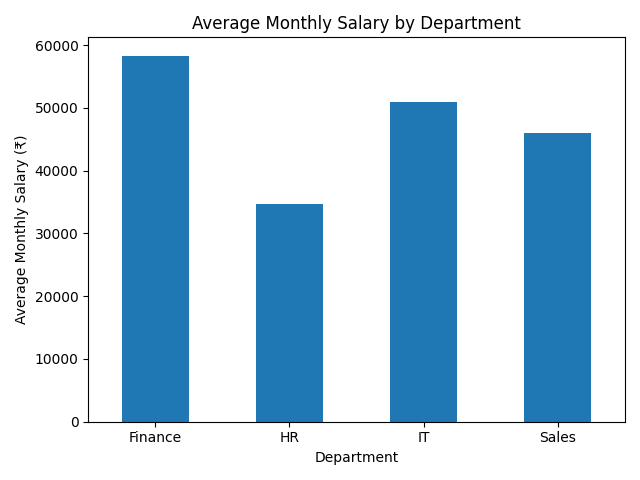
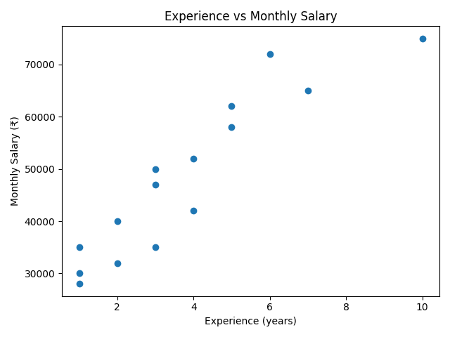
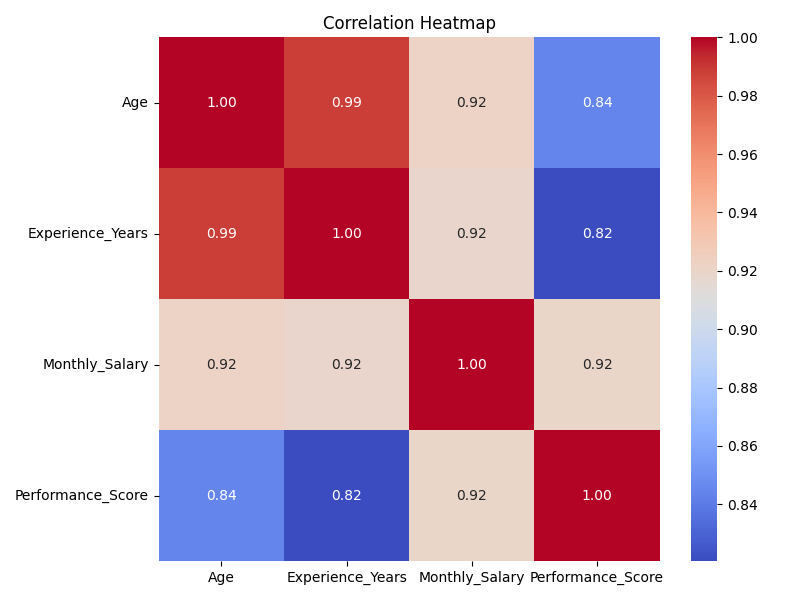

# Employee Data Analysis using Python

## Overview

This project was developed as part of my QSkill Python Development Internship.

The project uses Python to analyze employee data stored in a CSV file. Pandas is used for data loading and analysis, while Matplotlib and Seaborn are used to create visualizations.

The analysis focuses on employee age, experience, monthly salary, department, and performance score.

## Objectives

- Load and explore employee data using Pandas
- Calculate the average monthly salary
- Calculate average salary by department
- Analyze the relationship between experience and salary
- Calculate correlations between numerical variables
- Create bar charts, scatter plots, and a correlation heatmap
- Generate key insights from the dataset

## Technologies Used

- Python
- Pandas
- NumPy
- Matplotlib
- Seaborn

## Project Structure

```text
DATA_ANALYSIS_PROJECT/
│
├── data/
│   └── employee_dataset.csv
│
├── output/
│   ├── bar_chart.png
│   ├── scatter_plot.png
│   └── heatmap.png
│
├── analysis.py
├── requirements.txt
└── README.md
```

## Dataset

The project uses a small employee dataset containing information such as:

- Employee ID
- Department
- Job Role
- Age
- Experience
- Monthly Salary
- Performance Score

The dataset is used for learning and demonstration purposes.

## Analysis Performed

### Average Monthly Salary

The program calculates the overall average monthly salary of the employees.

### Department-wise Salary Analysis

The program groups employees by department and calculates the average monthly salary for each department.

### Experience vs Monthly Salary

A scatter plot is used to visualize the relationship between years of experience and monthly salary.

The project also calculates the Pearson correlation between these variables.

### Correlation Heatmap

A heatmap is created to visualize correlations between:

- Age
- Experience
- Monthly Salary
- Performance Score

### Key Insights

The program generates insights based on the calculated results instead of manually entering the values.

For this dataset:

- The average monthly salary is ₹48,200.
- Finance has the highest average monthly salary among the departments.
- Experience and monthly salary show a strong positive correlation.
- Monthly salary and performance score also show a strong positive correlation.

These observations describe relationships within this dataset and should not be interpreted as proof of causation.

## How to Run

### 1. Clone the repository

```bash
git clone https://github.com/kgreeshmika/DATA_ANALYSIS_PROJECT.git
```

### 2. Open the project directory

```bash
cd DATA_ANALYSIS_PROJECT
```

### 3. Install the required packages

```bash
pip install -r requirements.txt
```

### 4. Run the analysis

```bash
python analysis.py
```

The program prints the analysis results in the terminal and generates the charts in the `output` folder.

## Output

The project generates:

- `bar_chart.png` – Average monthly salary by department
- `scatter_plot.png` – Experience vs monthly salary
- `heatmap.png` – Correlation between numerical variables

## Visualizations

### Average Salary by Department



### Experience vs Monthly Salary



### Correlation Heatmap



## Learning Outcomes

Through this project, I practiced:

- Reading CSV files using Pandas
- Exploring and understanding datasets
- Grouping and aggregating data
- Calculating correlations
- Creating data visualizations
- Working with Python libraries
- Organizing a Python project
- Managing project dependencies using `requirements.txt`
- Documenting a project for GitHub

## Internship

This project was completed as part of the **QSkill Python Development Internship (2026)**.